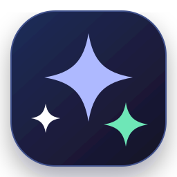

<p align="center">
  
</p>

<h1 align="center">AI Mode</h1>

<p align="center">
  The focused visual handoff for Google AI Mode.<br />
  <strong>Five images. One clear board. Zero lost context.</strong>
</p>

<p align="center">
  
  
  
  
</p>

AI Mode is not another chatbot. It solves one precise workflow: prepare a detailed question with up to five reference images, turn those images into one numbered visual board, and continue in Google AI Mode with the entire context intact.

## What it does

- Selects, previews, removes, and drag-reorders up to five images.
- Creates a high-resolution, numbered image board without cropping away visual context.
- Copies the prepared prompt and opens Google AI Mode in a partial Custom Tab.
- Receives text, one image, or several images directly from Android's Share menu.
- Saves boards to `Pictures/AI Mode`, with view and share shortcuts.
- Restores the current workspace across rotation or process recreation.
- Supports native Arabic RTL and English LTR interfaces, light and dark themes, edge-to-edge layout, and accessible labels.
- Processes images locally. The app has no analytics, API keys, accounts, or cleartext network traffic.

## The handoff

1. Add the images that carry the visual context.
2. Reorder them and write the exact question.
3. Tap **Prepare & open AI Mode**.
4. Add the latest saved board in Google AI Mode and paste the prompt.

## Build

Requirements: Android SDK 36 and Java 17 or newer.

```bash
cd android
./gradlew testDebugUnitTest lintDebug assembleDebug
```

The APK is written to `android/app/build/outputs/apk/debug/app-debug.apk`. Every push and pull request runs the same checks in GitHub Actions and publishes an installable APK artifact.

## Architecture

| Component | Responsibility |
|---|---|
| `MainActivity` | Workspace state, Android sharing, picker flow, permissions, and actions |
| `SelectedImageAdapter` | Native thumbnail strip, removal, and drag ordering |
| `CollageComposer` | Memory-aware decoding, EXIF orientation, and lossless visual layout |
| `BoardStore` | Scoped MediaStore saving across Android versions |
| `AiModeLauncher` | Partial Custom Tab and browser fallback |
| `CollageLayout` | Tested, deterministic board geometry for one to five images |

## Privacy

Selected images are decoded and combined on the device. The app only opens Google's website after the user asks it to; it does not upload files itself. Android backups and cleartext traffic are disabled.

---

<div dir="rtl" align="right">

## العربية

هذا التطبيق ليس دردشة جديدة. فكرته الأساسية هي تجهيز سؤال بصري متكامل لـ Google AI Mode: اختر حتى خمس صور، رتّبها، اكتب سؤالك، وسيصنع التطبيق لوحة واحدة مرقّمة ويحفظها محليًا ثم يفتح AI Mode مع نسخ السؤال تلقائيًا.

- يستقبل النصوص والصور مباشرة من قائمة المشاركة في Android.
- يحافظ على محتوى الصور كاملًا دون قصّ يضيّع التفاصيل.
- واجهة Android أصلية بالعربية والإنجليزية، مع دعم RTL والوضعين الداكن والفاتح.
- لا حسابات، لا مفاتيح API، لا تحليلات، ولا رفع للصور من داخل التطبيق.

</div>

